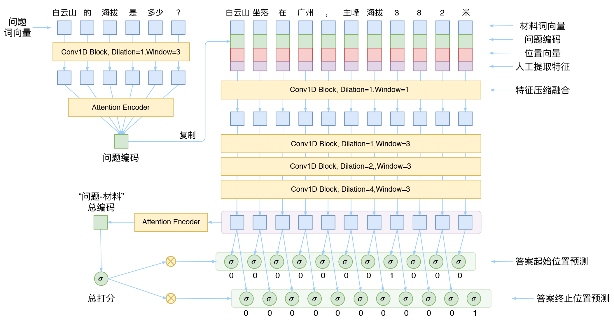

# A Implementation with Dilation Gate CNN For Machine Reading Comprehension.

## Requirements
* python==3.x (Let's move on to python 3 if you still use python 2)
* tensorflow>=1.12.0
* tqdm>=4.28.1
* jieba >= 0.39

## Model Structure
This model is come from JianLin Su. This is this model [blog](https://spaces.ac.cn/archives/5409) from him. Thanks for him of give him idea public, 
* I use word2vec to get word embedding, and the word2vec is by training, I didn't use pre training word2vec, because I use wordpices to train this model. 
* I also implement other embedding getting way, It's bert, you can find in another branch.
### Structure


## Training
You can use WebQA to train this model, or you want to change the dataset to yours, change the way of load data in data_load.py
* Run
```
python train.py --logdir myLog --batch_size 32 --train myTrain --eval myEval --bert_pre bertPreTrain --vocab myVocab --vocab_size vocabSize --gpu_nums gpuNumbers
```